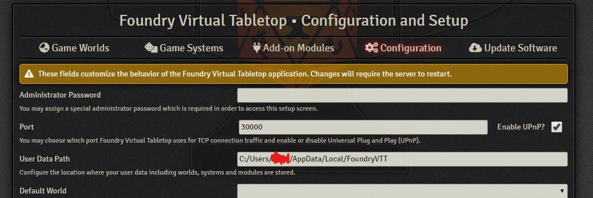
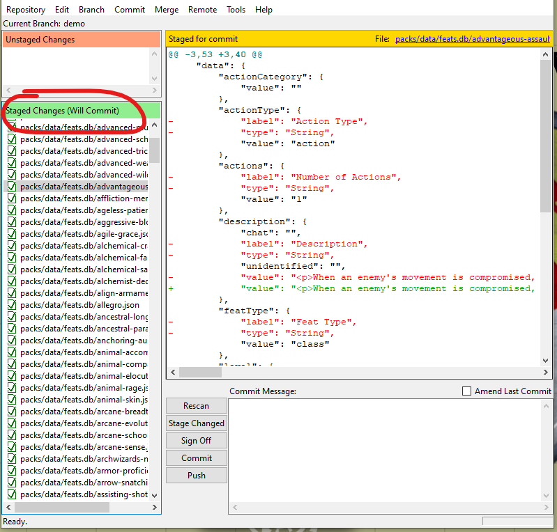
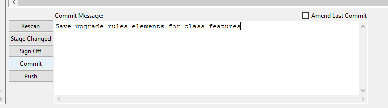

This page describes how to help out with the glamourous task of data entry and updating.

The basic principle is simple: you create a local copy of the Pathfinder 2 system, make your edits in Foundry, and then submit your changes. The changes get sanity checked by someone else, and then added into the next release of the system!

The rest of the page describes these steps in more detail, and assumes that you have very little technical knowledge, and are using Windows 10/11. 

If you're familiar with git, go read contributing.md, as that has the short version of this page ;).

## Making a Fork

Forking is as easy as clicking the fork button on the main Foundry page and signing up with a GitHub account if you don't have one. You want to have an actual account, not one you sign in from another service with because you're going to need a password. If you already made one with another service like sign in with Google or whatnot just go into your GitHub account settings and change the password.

You will need to set your forked repository to public.

## Making a Local Version
You need to install some software first, which will let you download the Pathfinder 2 system and edit it. Download and install these programs:
* [Node.js](https://nodejs.org/) (Use Node version 24.11)
* [Git](https://git-scm.com/download/win)

The next step is to use these bits of software to create your own local version. Start up "git cmd" - if you're on Windows, it should start up in your local user folder, which is fine. Replace the `<yourName>` in the following text, type it into the command line, and press enter `git clone https://github.com/<yourName>/pf2e.git master` This tells git to go and find the Pathfinder 2e system, and put a copy of it into a folder called 'master'. Then run `npm install -g pnpm@latest-10` to install pnpm.

You next need to navigate into the newly created folder by typing `cd master` into git cmd. Once you're in there, type `npm ci`. This tells the computer to install node package manager, which will be used for the actual editing steps.

### Finding your 'Path to Data'
You can open Foundry, and find out where local files are saved by looking at the User Data Path entry in the Configuration tab:



Now we want to link up your Foundry install with the dev build of the system. The first thing to do is to build the system. Type `pnpm run build --system=pf2e` and `pnpm run build --system=sf2e`, this will make a new folder with the built systems in it. This process takes a few seconds, and you'll see a lot of messages pop up as it compiles the system code into something Foundry can understand, and then all that is left is to place a symlink (symbolic link) for Foundry to use to point to the dev build of the system. You may need to launch command prompt in administrator mode for this next step, if you are using Windows Terminal instead of command prompt or Powershell you can edit the permissions in Windows Settings to launch as admin. Run `npm run link`, and you should be prompted to enter the Foundry user data path. This is the data folder under the user data path above. It should look something like `C:\Users\YourUserName\AppData\Local\FoundryVTT\Data`. Once you enter this the link will be created under the systems folder, it may ask you if you want to overwrite the existing system in there, replacing it with the symlink. You should only have to create the symlink once. If you get errors while doing this make sure you are running as an admin (otherwise you would see an EPERM error). You may also need to update Node to Node 18 if you are on an older version, or run `npm ci` again. If you ever delete the symlink (such as to return to the production build of the system you can recreate it by running `npm run link` again. When you build the system with `pnpm run build` it will build the latest version you have pulled from github, and the symlink just acts as a pointer telling Foundry where to find those files.

Tip: if you start getting weird error messages later on, a good first step is to repeat `npm ci`, as it often works to fix things.

## Using Git to Edit Foundry
Hurrah, you now have a local version of the Pathfinder 2 system that you can edit! Open up git cmd again, and navigate into the master folder.

The Pathfinder 2 system is updated a lot. You need to keep your fork up to date with the official version of the system, and keep your local copy up to date with your fork. To keep your fork up to date, go to your fork on the the GitHub website, and click here:


This [page](https://docs.github.com/en/pull-requests/collaborating-with-pull-requests/working-with-forks/syncing-a-fork)
has more details on syncing forks if you're having any trouble with this step.

To keep your local copy up to date with your fork, type `git pull`, which means 'go get the new version from the website'. Then use `pnpm run build` to build the new version.

## Work in Foundry
Now you can open up Foundry!

You'll know you did everything correctly if when you navigate to the Foundry data folder and go under systems you see a symlink icon on the pf2e folder.


### Editing Existing Items
Go find the compendium you want to edit, and unlock it by right clicking.  You can either edit the item directly within the compendium, or import the item to edit it. If you import the item, it's easier to test. If you do import, you need to export back into the compendium when you're done. To do that, put the edited item into the folder, right click, and select 'export to compendium'. You want to make sure that both tick boxes are ticked, so that your edited copy replaces the original version in the compendium.


### Adding a New Item
Create the item locally, and then drag it into the appropriate (unlocked!) compendium.

### Getting the Changes Out of Foundry
To save your changes properly, you need to use git cmd. Get back to the master folder, and type in `pnpm run extractPacks spell-effects --system=pf2e`.  

"spell-effects" should be replaced by the compendium you exported to within Foundry in the PF2e system; if the compendium has more than one word in its name, they'll be separate with - instead of spaces. If you've edited more than one compendium, enter the command multiple times. If you want to extract all packs you can run `npm run extractPacks all` however be aware that you may get a lot of extract noise in that process.  If your local version of Foundry has a different User Data Path than my example, you'll need to change this text to use your Foundry's location. 

Here's an example of a successful extractPacks on the PFS season 4 bestiary:


## More Fun with Git
Now comes the final stages to 'push' your changes to the main github website. 

Open up git cmd and navigate back to your master folder. You need to tell git to make a 'branch', which is a version of Pathfinder 2 with your changes. Type in `git checkout -b [branchname]` where [branchname] is whatever you want. Choose something not too long, like "corrected-dragons", as you may need to type it a few more times.

At this point, it's easiest to use `git gui`, which is another bit of software that git installed. You'll see a lot of files on the right hand side, which are called 'Staged Changes'. These are the documents you'll be uploaded in a few moments. Check them over in case Foundry has decided that you've edited some files that you haven't touched. Press Control-T when you're highlighting a file to 'unstage' it - this gets it out of the way for the next steps.

Here's what gitgui looks like with a load of 'staged changes'.  You can also use this program to select each file and see what's changed in the yellow panel - deleted info is in red, and added info is in green:



You need to commit your staged changes next. Type a brief description into the commit message box, and press commit:



Once you have the commit set you can click the push button to push your changes from your computer locally to your fork on github.

If you don't want to stage with git gui you can do it manually with `git add packs/data/*`, this tells git to put all the edits you've done to the db files into the files that will be uploaded onto the website. Then `git push` will push those committed files to your branch.

Finally, go to the github website and log in, and go to the Pathfinder 2 page. You should see a button near the top, asking you if you want to create pull request - press it!  On the next page, create a title that finishes the sentence  “If this PR is accepted, it will...” (eg "Automate kobold feats" or "Correct spelling error in the Sudden Charge feat"). You can add a longer description ("Correcting errors in all dragons from Bestiaries 1 and 2"). Press 'Create Pull Request' and you're done.

## Sanity Checking and Merging
Adding your changes to the main system is called merging. Before that happens, someone will sanity check your changes. You should get emails about this - sometimes the sanity checker will notice mistakes, or have questions about what you've done. Once those points are addressed, they'll merge your changes - and you'll see them in the next version of the system that gets published!

## Tips for your First PR
Make your first data entry update very small, just one or two feats or items. Git isn't very straightforward to use, and this will make it easier to deal with any problems (including potentially having to restart in git) than if you try to update every monster in Bestiary 1 at once! 

## Making Your Next Changes
When you stopped working in git, you were still messing around in your local little version or branch. Next time you want to work, go to the master folder and do `git checkout master`. This tells git to leave your local sub-version, and go back to the main folder. You'll want to do `git pull` next and start over from the `npm run build` step above.

Sometimes, git will complain about you having local files that will be lost. To shut it up, type `git stash save` and then `git stash drop` - this saves any left-over files, and then puts them in the bin. This probably isn't very good practice if you're using git properly, but it works for this dummy's guide version :).

## Keeping your fork up to date
To keep your fork up to date you will need to pull down changes from the main repo, which we will refer to as the `upstream` repo here. To see what you have called it on your local git install run `git remote -v` and you should see something like this


this will tell you what the names of each repo are. Typically these will be `origin` and `upstream` but some installs may differ.  To update your fork run these:

`git checkout master`

`git pull upstream v13-dev`

`git rebase upstream/v13-dev`

Then push the branch (you should not need to make a commit, just push). If you are using github mirroring (premium feature or grandfathered account) this step can be reduced to simply `git checkout master` followed by `git pull`.

## Git troubles
If you are having problems with git, or your master branch had something pushed to it that is breaking all attempts to fix it you can rescue your branch by forcing it to be identical to the current fork.

```
git checkout master
git reset --hard HEAD~1000
git pull --ff-only https://github.com/foundryvtt/pf2e.git v13-dev
git push --force origin master
```

This is a hard reset from the main repo. It shouldn't be necessary often, only when your fork is having issues. It will clear any changes you have made to your master branch and overwrite them.


## Reminder List
Once you're familiar with the above, here's a quick summary of the steps you need to do with git and foundry to make a new branch:
* git checkout -b new_branch 
* some work 
* git gui 
* choose your commits and write a commit message 
* commit and push from the gui (easier than terminal) 
* git checkout master so the changes you just made don't move onto your next project
