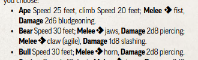
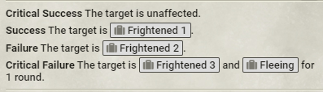
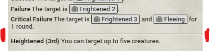

## General Principles 

This is a style guide for entering actor, item, and journal data into the PF2e system. For entry into the system we try to match Paizo's printed style where possible, with a few exceptions due to the difference between publishing a printed book and a digital resource. For entry for your modules we recommend following this guide as well, since consistent style makes it more likely that future system changes and migrations go smoothly for your content as well.

This page will often refer to `items`. When we do this we are using the Foundry definition of an item, which is something that goes on an actor. Equipment, spells, feats, effects, actions, etc are all items.

We have [an automated script](https://github.com/TikaelSol/PF2e-Foundry-Data-Entry) to help with data entry. It will automatically set up most of the inline formatting for you, and it is encouraged that you always use the latest version of the tool available. As with any automated tool you should double check the output. When major updates are done to the tool we send a message on discord to the data entry team. If you are routinely doing system data entry and do not have this role please ask to have it added to you so you have access to the data entry dev channels. This role does require a history of system contributions however, as our dev channels are not meant to be public.

## Inline Automation

The system makes extensive use of inline automation, from inline checks, damage rolls, and template buttons. Here we detail each of those types of inline automation and how to use them. For any of these inline options for system entry always put parameters in the order they are listed in this guide.

### Inline Roll Links

Roll links are very useful for any rolled value (e.g. 'breath weapon recharges in 1d4 rounds') or value that's handy to output to chat (e.g. 'the monster heals 10 hit points after using this ability'). Inline rolls are done with a pair of brackets `[[/r 1d20+17 #Counteract]]` This would make a button showing 1d20+17 and have a roll flavor of "Counteract". Inline rolls like this are useful for non-damage rolls.

As of PF2e v5.3 we have implemented `@Damage`. This is a more versatile way of handling inline rolls. The syntax for a simple damage roll looks like `@Damage[1d6[fire]]{ouch!}` with `@Damage` and like this `[[/r 1d6[fire]]]{ouch!}` in the old style. The string in curly braces at the end gives the link a custom label: without one a simple label will be automatically generated. For other damage types, substitute in the desired type, or simply omit it if the damage has no particular type.  The bracketed damage type has a very high "operator" precedence in the roll-formula syntax, making parentheses necessary when used with more complicated expressions: `@Damage[(1d6 + 3)[fire]]`. For damage formulas with multiple damage types, separate, comma-separate pools of dice added to a single roll: `@Damage[5d6[acid],5d6[cold],5d6[fire]]`. The benefit of using `@Damage` is that it is processed before rendering down to HTML, which means that you can target it with rule elements to override the damage dice or apply modifiers. An `@Damage` roll on an NPC will automatically gain a +2 modifier if you make the NPC elite, and a +4 modifier if that ability has a set frequency.

We can also add special damage categories to a roll: `@Damage[(2d6 + 4 + (2d6[precision]))[slashing]]`. This would deal 2d6+4 slashing plus 2d6 precision slashing damage. Note the inner parentheses for precision damage, which are also necessary for splash (@Damage[(5[splash])[fire]]). Persistent damage can also be added: `@Damage[1d6[persistent,fire]]`. Note the _lack_ of inner parentheses for persistent damage, as well as its inclusion directly alongside the damage type.

`@Damage` picks up the traits of the item it it embedded in, but it also supports manually adding additional roll options just like `@Check` does: `@Damage[2d6[fire]|options:area-damage]` this would enable automation for a swarm's weakness to area damage, for example.

If the number isn't a damage value, use something like `[[/gmr 1d4 #Recharge Breath Weapon]]{1d4 rounds}` or equivalent. In this example of a monster cooldown, we use GM rolls (`/gmr`) to hide the roll message from players.

You can include any system roll options in the options parameter of `@Damage`, for example you can use the `damage:material:x` options to make an inline damage roll that counts as being a precious material, like fire that counts as silver and cold-iron: `@Damage[1d6[fire]|options:damage:material:silver,damage:material:cold-iron]`. The multiple colons in these roll options may make this seem strange typed out, but they are still comma separated values like any other argument and no different to `@Damage[1d6[fire]|options:x,y]` to the code that parses this text.

### Inline Check Links

You can make an inline roll links for different checks, including setting a DC to output the degree of success, traits and other roll options can be pushed to the roll to make the links activate automation stored in rule elements and elsewhere.

`@Check[fortitude|dc:20|basic]`

The link will inherit the traits from the item and actor it is on. For example, placing the above link on a breath weapon for a large dragon and giving the action the poison trait will automatically pass the `origin:trait:dragon`, `action:breath-weapon`, `origin:size:large`, and `poison` roll options. It would also have `damaging-effect` added automatically by being marked as a basic save. For simplicity sake this syntax calls all the roll options `traits` as part of the input, anything can be passed in them and they will enable automation of specific bonuses. For saves against damage that are not basic save, remember to add `damaging-effect` to make Bulwark or other automation work properly. 

Skill rolls can also be made using the following syntax: `@Check[athletics|dc:20|traits:action:long-jump]` as well as Perception rolls: `@Check[perception|dc:20|traits:auditory]` or `@Check[perception|dc:24|traits:secret]` to have a blind rolled search check. Flat rolls can also be done with this syntax: `@Check[flat|dc:4]`

Multiple types can be included in a single inline declaration. This created multiple buttons with a line break between them. `@Check[arcane,occultism|dc:20]` would create two buttons with the same DC. You can also pass an adjustment to each button separately, like so: `@Check[crafting,thievery|dc:20|adjustment:0,-2]`. This would create a button for a DC 20 crafting check and a button for a DC 18 thievery check. Since the system implements inline checks in text directly from Paizo products we should prefer to use a single `@Check` declaration for each button when entering data, rather than stacking them.

The full list of applicable fields is as follows. For the purposes of data entry into the system, the attributes should be in the order presented below:

`type` - Supported type values are: flat, perception, fortitude, reflex, will, a skill slug in short or long form e.g. med or medicine, a lore slug such as `engineering-lore`, or a statistic slug such as `kineticist` for the kineticist class statistic. Everything from the system except lores will have a default localized inline link label that can be overwritten by adding `{Some Label}` to the check. This is the only mandatory parameter, however `type:` can be excluded. `@Check[athletics]` will work because the first parameter is always assumed to be `type:`. The system has standardized to omit `type:`.

There are three ways to set the DC for the roll. Only use one of these in any given inline check.

`defense` - The defense statistic to roll against. This is the only way to refer to target actor data. `@Check[deception|defense:perception]` for example would roll a deception check against the targeted creature's perception DC.

`against` - The statistic to use for the DC. This should be used in place of `dc` when resolving in most cases and can even duplicate the role of `defense`. `@Check[reflex|against:class-spell|basic]` Would make a basic reflex save against the higher of the origin's class or spell DC. Can be used in conjunction with `rollerRole` 

`dc` - A numeric value that sets the DC. You can also use `@self.level` for a level based DC of the roller from the DC by level chart, not that this is not the owning actor's level based DC, but the actor making the roll. There is no current way to include target data in these rolls. You can resolve data from the item the check is embedded in or the actor the item is on using `resolve(...)` as an input. `resolve(@actor.attributes.classDC.value)` or `resolve(max(1,5,@actor.level))`. `resolve()` will try to resolve any value on the actor (@actor...value). For example, a link resolving the class DC would be `@Check[type:reflex|dc:resolve(@actor.attributes.classDC.value)]`, or a link to resolve the higher of class or spell DC would be `@Check[type:will|dc:resolve(@actor.attributes.classOrSpellDC.value)]`. This actor data can be found in the Foundry console, and is subject to change as system data structure changes. Changes to the structure are normally migrated, so little maintenance should be needed for these inline links in this regard.

We can also modify the inline check with more optional parameters:

`rollerRole` - For use with `against`. This sets the role of the roller and can be either `target` or `origin`. By default `against` uses `target` for any save, and `origin` for any other check. `@Check[perception|against:deception|rollerRole:target]` for example will roll a perception check against the origin's deception DC (ie, the target of the ability is the one expected to roll), while `@Check[perception|against:deception|rollerRole:origin]` will roll a perception check against the target's DC. For the system do not include this parameter unless necessary to change the default behavior.

`basic` -  Only works with save checks. The inline roll label will be `Basic {checkName}` e.g. Basic Reflex. This automatically includes the `damaging-effect` roll option when used.

`showDC` - Defaults to `owner` visible only. Can be changed to `gm` to only show the GM or `all` to show DCs to all players, or `none` to show the DC to no one.

`adjustment` - Increases or decreases the dc field based on the value. For example `@Check[performance|dc:@self.level|adjustment:2|options:action:perform]` would be a link to roll a perform check at a hard DC for the roller's level, useful for things like Lingering Composition or One for All. `@Check[reflex|against:kineticist|adjustment:-2]` would use the kineticist class DC - 2.

`immutable` - The DC is static and will not be changed by modifiers like frightened, elite, or weak.

`name` - The name of the check in the rolled chat card. This will default to {itemName} DC if no name parameter is given.

`traits` - Any additional traits that the roll should have. If no traits parameter is given the roll traits will default to the  item traits. The final traits will be a deduplicated list of item traits, actor traits, action name, and parameter traits. Any check with the **secret** trait will be rolled as a blind roll by the system.

`options` - The options parameter is for roll options that are not proper PF2e traits. For example, `@Check[reflex|dc:25|options:damaging-effect]` would create a roll with the `damaging-effect` roll option, which would enable the automation on bulwark. `damaging-effect` is not a trait, because it does not appear on the traits line on any item.

`overrideTraits` - The roll traits will omit the item traits.

### Inline Actions

The system action macros can also be called inline. Unlike the other inline functions these do not use an `@` notation for technical reasons. Instead, they use a notation similar to the base Foundry inline rolls: `[[/act grapple]]`. You can find the full list of action macros that can be used this way by typing `game.pf2e.actions` into console (F12 for most browsers).


Some actions have variants, and some actions require a variant to be specified: `[[/act administer-first-aid variant=stop-bleeding]]`

To find all of the variants for an action expand it in console, then expand the variants


The property you want out of this is the `slug`.

Like other inlines you can also specify a DC: `[[/act sneak dc=20]]`.

These DCs can also pull from actor data for the target: `[[/act seek dc=thievery]]` would roll a perception check to Seek against the thievery DC of the targeted creature.

You can also swap the statistic used in the inline to another statistic: `[[/act make-an-impression statistic=performance]]`

### Inline Template Links

Links can be made to create pre set templates.  These use the PF2e names for the templates, not the Foundry names.  You only need to specify the shape and distance, by default it uses the user's assigned color.

`@Template[type:emanation|distance:x]`

`@Template[type:burst|distance:x]`

`@Template[type:cone|distance:x]`

`@Template[type:line|distance:x]`

The labels for these links will automatically be generated as `X-foot Type`, but a label can be specified. For cases where a label is needed, for example in an aura where the word emanation is dropped we can manually specify. `@Template[type:emanation|distance:90]{90 Feet}`.

There are also optional fields.

- The `traits` field is optional, and should be omitted if left blank. By default the command will provide the traits from item data. Traits are picked up by certain modules and should not be included in any system data entry.
- The `width` field is optional, and should be omitted left blank. It can be used to create a line template with a width larger than 5 feet (default if omitted). A Wand of Crackling Lightning for example would use an inline that looks like `@Template[type:line|distance:120|width:10]{120- by 10-Foot Line}`

`width` should be used to make square or rectangular templates: `@Template[type:line|distance:20|width:20]{20-Foot Square}`. While it is possible to use the Foundry `rect` template type as an inline doing so is not advisable as the same results are more easily obtained by using `line` with a width. `rect` can only be used with the old `<span ...>` tag method.

If you need to make a very specific template the shape can be passed and the template data can be passed as a JSON object directly in the HTML form of these using any of Foundry's or a module's template data such as specifying the fill color, line color, angle, etc.  **These should not be used in the system but are provided here only for user reference.**

`<span data-pf2-effect-area="cone" data-pf2-template-data='{"fillColor": "#15B39D", "distance": 15, "angle": 90}'>15 foot cone</span>`

### Inline Localization

We can insert text from the system localization files inline in an item or journal using `@Localize`. This lets us put text in an ability and have it update and automatically localize for people using a translation module. This is typically used in Bestiary Ability Glossary items. The Buck monster ability, for example, looks like this in Foundry


But if you edit the text you see this


The localization call includes the path to the text to localize, and automatically inserts that text when building the HTML that is shown to the user. When using Note rule elements you don't need to include the `@Localize` in the note text as long as the entire text of the note is the localization string. This inline tool is mostly used in common creature abilities like Grab, or in journals to reference things like trait descriptions.

### Inline Embeds

We can embed the text of any item from compendium in another item description or in journals using `@Embed`. This lets us quickly copy the text from another item dynamically. This lets us include auto updating text embedded in another item or journal.


turns into


When using embeds you need to specify that the embed is inline, otherwise it will create a title and link to the item as well. `@Embed[Compendium.pf2e.feats-srd.Item.39CqlOzlHjEhh0E4 inline]` you can also remove the horizontal line that separates the prereqs of some feats from the text by adding an additional `hr=false` argument `@Embed[Compendium.pf2e.feats-srd.Item.39CqlOzlHjEhh0E4 inline hr=false]`


This is most useful in journals, where we list out archetype feats. Suppressing the hr tag allows the prereqs line to be included with other top level items to present them how Paizo does, with prereqs, requirements, access, frequency, and triggers all being separated from the body of the item. Items that have those other entries will already have a hr tag to add the separation, so further separating the prereqs is redundant. 

## Formatting

Paizo's text is sometimes very compressed, as they have to worry about fitting things onto physical pages of printed text. We don't have that problem, and so extra line breaks and formatting can (and should!) be added to aid readability. For example, look at our version of Animal Form versus the PDF:




If an ability has critical success/success etc. outcomes, these should be separated from the main ability text by a horizontal line:


Item activations should look like this:


Bold the Activate text as well as the name of the activation. Separate the top level of the activation (the name, action cost, traits, trigger, requirements, etc) and the effect or activation description with a `<hr>`.

If an item has multiple activations we change our normal practice of putting an `<hr>` between the top text of the activation and the effect itself to instead put an `<hr>` between each activation. This helps to more quickly see the separation between different effects without looking too crowded.

For example, the Singing Sword


#### Action Symbols

Use the in-built font style for action symbols (make sure the text isn't set to bold, as otherwise they're hard to read). If you're updating an older item, the action symbols will be in a different font style that doesn't fit as well within the lines - and so they should be replaced with the new version.

#### Bold and italics

We follow Paizo's style guide for emphasis:


Generally, if it is bolded or italicized in the PDF it should be wrapped in `<strong>` or `<em>` tags in Foundry. One exception is links to spells, those labels are automatically italicized.

### Conditions
A condition should be linked the first time it's referenced. If there's a number associated, make sure to link it once for each numerical value. See Fear as an example:



Here's the correct format for linking conditions, which should happen automatically if you drag and drop within Foundry or use the data entry script: `@UUID[Compendium.pf2e.conditionitems.Item.<ID>]{<Conditiontext number>}` e.g. `@UUID[Compendium.pf2e.conditionitems.Item.e1XGnhKNSQIm5IXg]{Stupefied 1}`. Once the changes are extracted the ID will change to the item name for easier review outside of Foundry.

## Bestiaries

### Abbreviated Abilities

Paizo sometimes saves space by saying an ability is identical to that of another monster. For example, Raja-Krodha gives this for its Knowledge of Delusion ability.


We don't have to worry as much about space, and so always copy and paste the full text in and replace references to the creature type as well as any necessary updates to DCs or damage values.


For example if a generic NPC had an ability with the text `The ruffian brandishes his sword while striking with it. He attempts to demoralize then makes a scimitar strike against the same target`. If a female NPC named `Lucy` had this ability and simply had the text `As ruffian` you should edit the text to `Lucy brandishes her sword while striking with it. She attempts to demoralize then makes a scimitar strike against the same target`. This changes the references to the specific NPC and alters the gendered language to match the stated gender of the NPC. If the NPC has no listed gender in the book at all use `they` / `them` pronouns.

### Bestiary Ability Glossary

There are two compendiums that contains commonly-used monster abilities, the bestiary ability glossary and the creature family ability glossary. If you're editing the monster with an ability from here, add a fresh copy onto the monster.

Entries in these compendiums are not arbitrary, they are either defined in a bestiary glossary or given as part of a package of abilities selactable for that creature family.

For effects like telepathy, scent and so on, add the extra info about the range or degree of precision into the ability title (e.g. "Telepathy 100 feet" or "Scent (Imprecise) 60 feet)"). If there's a lot of information here, it may be better off in the first line of the ability (e.g. "Telepathy 100 feet" as the title, with "Other myconids and those affected by purple poison only" in the main ability body. Note the capitalization of `Imprecise`, but the lack of capitalization on `feet`. This is the standard for ability titles where the units do not follow title case.

For creature family abilities prefix the ability name with `(<Family>)` in compendium, but remove this once the ability is on the monster. So, in compendium we have `(Vampire, Basic) Drink Blood`, and once placed on the NPC we rename it to simply `Drink Blood`.

### Bestiary Monster Lore 

Lore thats available in the Bestiaries and `Adventure Toolbox` sections of APs can and should be added to monsters where possible. This can be done on the `Notes` tab of the default NPC sheet.


Text specific to a monster should go above text specific to a family of monsters, and should be separated by a horizontal line, as shown above. Below creature family descriptions we can put relevant sidebars. Some sidebar information is relevant to entire families of creatures such as the above example, some is relevant only to that specific creature. If a creature lacks family information, or family information is in a different book don't add any.

Some sidebars contain mechanical information about the creature in question. Because GMs do not expect mechanical information in the notes section move this to a new passive ability on the creature in question. For example the Quickiron Plasm (Pathfinder Rage of Elements page 154) has the following sidebar:


This is then on the actor's abilities for quick reference for the GM. These new passives can be set as interaction for their action category.


Some sidebars contain mechanical information that requires the creation of variant creatures. For example this sidebar in Soulbound Doll (Pathfinder Bestiary page 304):


### Attack Effects

If an attack has a secondary effect (e.g. Grab), it should be linked into the attack. Make sure to add a copy of the ability to the monster, and then it'll turn up in the chat log when the GM uses that attack!


Make sure to always add the ability itself to the NPC, even if it can be selected as an attack effect without being on the actor.

### Rules Effects

Many monster abilities can be automated by adding rules elements to the relevant ability. See the rules element page on the wiki for details on how to do this.

### Skills

Many NPCs have bonuses to skills in specific situations, e.g. a +4 to Stealth in forests. To add these bonuses, click on "Add Special" under the skill in the NPC skill editor:


Type the text as presented in the PDF into the label field (don't enter the modifier in the label). You must add a predicate for any special modifier, for how to write predicates see the rule elements page on this wiki. Typical options for roll modifiers are `terrain:X`, `action:X`, `target:X` for a condition on the target. For example a bonus to athletics to trip would use `action:trip` or a bonus to lie to humanoids would use both `action:lie` and `target:trait:humanoid`. The modifier for the special roll will be combined with the label in the sheet, as shown.

If you are in doubt about the roll options to use look for similar creatures or abilities. In general terrain roll options will be in the form `terrain:<terrain-name-singular>` so a bonus to survival in deserts would predicate on the roll option `terrain:desert` (singular). Bonuses in different lighting conditions are done with `lighting:dim-light` for example, under the lighting option domain instead of terrain.

### Missing DCs

Sometimes Paizo neglects to add a DC to a creature's ability, calling instead for a save. In those cases we use a moderate DC from the creature building guidelines (https://2e.aonprd.com/Rules.aspx?ID=995). Once you have looked up the right DC and put it into an inline check add the following to the bottom of the ability text

```html
<hr /><p><em>Note: A DC was not provided for this ability by Paizo. The DC present here is a moderate DC for the creature level according to the GM Core creature building Tables.</em></p>
```

### Monster Spells

#### DCs and attack rolls
 
Sometimes only a DC is listed. In this case, put the DC - 8 into the attack value, so we don't have an empty box (the tables in the GMG always set the attack value at 8 lower than the DC).

#### At Will and Constant Spells

If a spell is at will or constant, add that into the spell's title. You should also add the 'constant spells' ability from the glossary if a creature has any constant spells.

#### Bespoke Spells

If a spell has a restricted target or other note, update it (both the description and details page) to match that info, as well as putting it in the title. 

If the alterations are really long-winded they'll make the spell look weird. Instead, add 'Modified' to the spell name and list the modifications at the start of the spell's description

## Spells

### Damage
Spells that deal damage will have a button when cast that lets you roll the correct damage, and so the core damage (e.g. 6d6 fire for Fireball) doesn't need to be made into a roll link.

### Formatting
There should be a horizontal line between the main part of the spell and the heightened text.



For spells with different effects on critical success through to critical failure, put each entry onto its own line - it makes it much easier to read.

You can put a horizontal line between the spell introduction and the saving throw breakdown.'

## Consumables

Consumable items, including consumable weapons like alchemical bombs, should include their activation in the description followed by a horizontal line.


As normal for the line if there is other information to be included in the header then place the line between the header and the beginning of the description.

## Effects

Effect descriptions for player facing content should start with a single line `Granted by @UUID[<source UUID>]` preceding the main description of the effect. Bestiary effects do not need this as there is typically not something to link back to.

The main description of an effect should, in general, only say *exactly* what the effect actually automates. Do not include things the effect item does not do, and do not include the duration in the description. For example, a spell effect granting a 20 foot fly speed and Quickened that can only be used to fly would have an effect with a main description of `You gain a 20-foot fly speed and become Quickened.` Since the system has no way of automating the restriction on action uses we should not include that in the effect description. The single exception to this is very complicated effects. Legacy oracle mysteries, battleform effects, and the like may benefit from including the entire rules and splat text since summarizing them can be a very difficult thing and referencing the rules on the effect may be necessary more often.

Actions and feats can have effects set as a `self applied` effect in the details tab. This should be used when the effect can be applied to the character using the action. If the effect is meant to be applied to a target then link the effect directly.

In general the system should prefer to condense effects. An ability that gives a -1 penalty on a failure and a -2 penalty on a critical failure should be a single effect using a ChoiceSet rule element to select the penalty rather than being one effect for each outcome. The largest exception (currently) is if the duration differs, as the system does not currently support duration alterations. If two or more effects must be made, use a single parenthetical regardless of the number of pieces of information that must be presented. For example `Effect: Name (Blue, Red, Critical Success)` should be used instead of `Effect: Name (Blue) (Red) (Critical Success)`. This is important, since multiple parentheticals can make parsing using code unsafe and we often use scripts to audit or modify items compendium-wide. Link each effect either following the applicable outcome or below the description. For very large descriptions consider following a format like the Animal Form spell uses.

Effects can be very easily (and accidentally) removed. Therefore, effects are only used for temporary things. Do not make effects for things that are intended to be permanent. If you find a situation where a permanent buff needs to use something like a badge counter bring it to the system discord so we can find a solution.

## Rule Elements

The system should use the most condensed set of rule elements that accomplishes the automation, with some exceptions if more rules produces a more elegant implementation. For example, if the most compact way to implement an effect is to use 3 FlatModifiers with different slugs then consider using AdjustModifier instead even if it takes more than 3 rules. This saves users from expanding their roll dialog with duplicate entries.

All labels, notes, and description alterations in the system should be localized. Our general rule for localization should be to keep things as organized as possible, with new strings being added to the place that makes the most sense for them. New generic prompts should be added to `PF2E.SpecificRule.Prompt`, rather than added to a specific rule section for that item alone. Specific prompts should be entered with the rest of the item localization. Generally, we should try to reduce the number of new localizations needed either by being judicious when you consider if adding something like a description alteration is actually necessary, or by using references to the item data such as `{item|name}` and `{item|description}`.

The system tries not to implement things in hacky or strained ways, preferring those methods be reserved for modules. If something can only be done in a roundabout way using the existing automation tools please discuss with us ways to either make it easier to do or ways to simplify it before spending hours working on a complex implementation.

## Publication Data

The publication, or source data for items is very important for us to track as accurately as possible following the split from the OGL license. Each item should include accurate license data. Note that not all remaster products are ORC licensed (Rage of Elements is OGL licensed but uses remaster rules).

Each item and actor has a source value. These should be filled according to the book the creature or item is from. It's only necessary for the base sheet, not embedded items like NPC-strikes. For NPCs, this field can now be set on the `Notes` tab. For hazards this can be set at the bottom of the sheet when editing it.

The source should match the name used by Paizo on license page of the PDF with the exception that we remove the words `Adventure Path` and parentheticals from AP volumes. So `Pathfinder Adventure Path #166: Despair on Danger Island` becomes `Pathfinder #166: Despair on Danger Island`.

## Github

When making a PR to github put your title in imperative case. Much like effects the title should tell a reader exactly what the PR does in a single sentence. Start PR titles with a capital letter and write them to finish the sentence `If merged this PR will ___`. Examples:

`Automate Swashbuckler finishers`
`Fix spell details for Talking Corpse`
`Brush up Monster Core monsters (A-B)`
`Fix source data for several items`

Aim for a short title if possible, these often turn into the changelog entries so it saves work if they are already in a short one line format anyone can understand.

Sometimes a contributor will be given triage privilege here on github. This gives them permission to tag PRs and issues. If you are given this permission here (typically given after many merged PRs), please do not tag code PRs or issues (enhancement, bug, etc). The system leads use those tags to denote that one of them has looked at the issue or PR already, so tagging them before they can means issues may get missed. Data issues and PRs are fine to tag, since data PRs and issues are faster turnaround.

When submitting a PR that closes an issue put `Closes #<number>` in the PR description. This will automatically close the open issue on merge. If the PR does not fully address the issue (because the issue has multiple parts, or requires multiple PRs to fully fix), use `Partially addresses #<number>`.